  

### Привет, я MagentaFNS

Это мой публичный профиль как разработчика.

Здесь я учусь, ошибаюсь, расту и превращаю сложное в работающие вещи.

---

### Сейчас в фокусе

- **Изучаю:** Python, FastAPI, базы данных и архитектуру бэкенда.
- **Строю:** [DevJournal](https://github.com/MagentaFNS/DevJournal) — дневник для командной аналитики.
- **Экспериментирую:** в репозитории [Learning](https://github.com/MagentaFNS/Learning).

  
  
  
  

  
  

